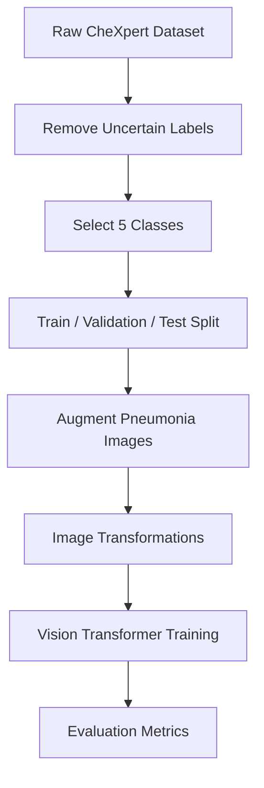
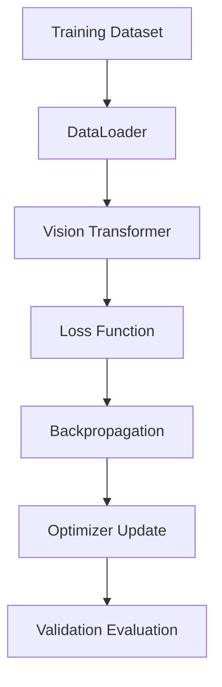

# 🫁 Chest X-ray Disease Classification using Vision Transformers

## 📌 Project Overview

This project develops a deep learning system to classify chest X-ray images into **five thoracic disease categories** using a **Vision Transformer (ViT)** architecture.

The goal is to explore modern transformer-based models for **medical image classification** while addressing common challenges such as:

* Class imbalance
* Subtle disease patterns in radiographs
* Reliable medical evaluation using ROC-AUC

The project is based on the **CheXpert chest X-ray dataset**.

---

# 📊 Dataset

**Dataset:** CheXpert (Stanford)

A large dataset of labeled chest radiographs for automated thoracic disease detection.

### Selected Classes

| Label | Category        |
| ----- | --------------- |
| 0     | Normal          |
| 1     | Pneumonia       |
| 2     | Disease Class 2 |
| 3     | Disease Class 3 |
| 4     | Disease Class 4 |

### Initial Class Distribution

| Class         | Samples |
| ------------- | ------- |
| 0             | 15000   |
| 1 (Pneumonia) | 3580    |
| 2             | 10000   |
| 3             | 10000   |
| 4             | 10000   |

---

# 📂 Dataset Split

| Dataset    | Samples |
| ---------- | ------- |
| Training   | 34,006  |
| Validation | 7,287   |
| Test       | 7,287   |

Uncertain labels from the dataset were removed during preprocessing.

---

# ⚙️ Data Processing Pipeline



---

# 🔄 Data Augmentation

The Pneumonia class was significantly smaller compared to other classes.

To address this:

* Additional Pneumonia images were generated using **augmentation**
* Applied **only to the training dataset**

### Augmentation Techniques

* Horizontal Flip
* Random Rotation
* Random Resized Crop
* Brightness Adjustment
* Contrast Adjustment

This improves **training diversity** and helps the model learn pneumonia patterns.

---

# 🖼 Image Preprocessing

### Training Transformations

```
Resize (224×224)
Random Horizontal Flip
Random Rotation
Random Resized Crop
Color Jitter
Normalization
```

### Validation/Test Transformations

```
Resize (224×224)
Tensor Conversion
Normalization
```

Validation and test sets are **not augmented** to ensure unbiased evaluation.

---

# 🧠 Model Architecture

The model used is a **Vision Transformer (ViT)**.

### Vision Transformer Workflow


### Model Configuration

| Component    | Value              |
| ------------ | ------------------ |
| Architecture | Vision Transformer |
| Model        | ViT-Base-Patch16   |
| Input Size   | 224 × 224          |
| Classes      | 5                  |
| Pretrained   | Yes                |

Vision Transformers capture **global spatial relationships** within images, which helps detect subtle medical features.

---

# 🏋️ Training Configuration

| Parameter     | Value            |
| ------------- | ---------------- |
| Optimizer     | AdamW            |
| Learning Rate | 1e-4             |
| Scheduler     | Cosine Annealing |
| Batch Size    | 32               |
| Epochs        | 10+              |
| Loss Function | CrossEntropyLoss |
| Class Weights | Applied          |

### Class Weighting

Class weights were used to reduce bias toward dominant classes and encourage learning for minority classes like Pneumonia.

---

# 📈 Model Training Pipeline



---

# 📊 Evaluation Metrics

Medical imaging models require multiple evaluation metrics.

The following were used:

* **Accuracy**
* **ROC-AUC (Macro)**
* **Per-Class ROC-AUC**
* **Confusion Matrix**
* **Precision / Recall / F1 Score**

ROC-AUC is particularly important for measuring the model’s ability to distinguish disease classes.

---

# 📉 Current Results

### Test Performance

| Metric        | Value      |
| ------------- | ---------- |
| Accuracy      | **65.03%** |
| Macro ROC-AUC | **0.8659** |

---

### Per-Class AUC

| Class     | AUC    |
| --------- | ------ |
| Normal    | 0.8777 |
| Pneumonia | 0.7940 |
| Class 2   | 0.8961 |
| Class 3   | 0.8983 |
| Class 4   | 0.8635 |

---

### Classification Report (Summary)

| Class     | Precision | Recall | F1   |
| --------- | --------- | ------ | ---- |
| Normal    | 0.74      | 0.69   | 0.71 |
| Pneumonia | 0.41      | 0.22   | 0.28 |
| Class 2   | 0.63      | 0.75   | 0.68 |
| Class 3   | 0.66      | 0.66   | 0.66 |
| Class 4   | 0.59      | 0.64   | 0.62 |

---

# 🔍 Key Observations

* Model shows **strong class separability** (Macro AUC ≈ 0.86)
* Pneumonia detection remains challenging due to:

  * class imbalance
  * subtle X-ray patterns
* Other disease classes perform relatively well.

---

# 🚀 Future Improvements

Potential improvements include:

* **CLAHE contrast enhancement** for chest X-ray images
* **WeightedRandomSampler** for balanced batch training
* Hyperparameter optimization
* Advanced augmentations
* Test-time augmentation

---

# 🧰 Technologies Used

* Python
* PyTorch
* Torchvision
* Vision Transformers
* OpenCV
* Scikit-learn
* Pandas
* NumPy

---

# 🎯 Conclusion

This project demonstrates a complete pipeline for **chest X-ray disease classification using Vision Transformers**. Despite challenges such as class imbalance and subtle radiographic patterns, the model achieves strong ROC-AUC performance.

With further improvements in preprocessing and sampling strategies, the model can potentially achieve even better performance for **pneumonia detection and clinical decision support**.

---

# 📷 Example Result Visualizations (Add to README)

You should include these images in your GitHub README:

```
results/
   confusion_matrix.png
   roc_curve.png
   training_curve.png
```

Example:

### Confusion Matrix


### ROC Curve


---

# 👨‍💻 Author

**Palle Bharath Kumar Reddy**

AI / Machine Learning Project
Chest X-ray Disease Classification
